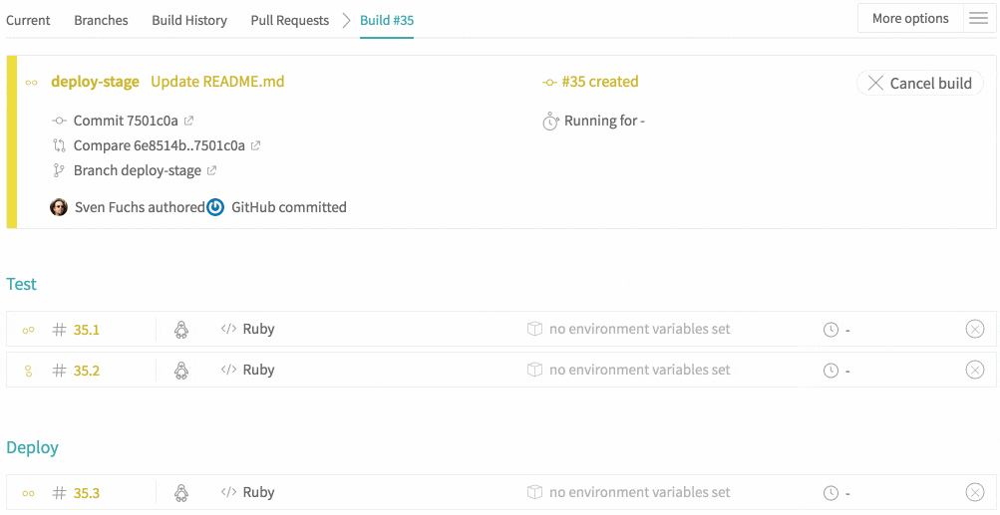

# 构建阶段

##	什么是构建阶段[#](#what-are-build-stages)

​	构建阶段是一种对作业进行分组的方法，可以在每个阶段并行运行作业，但是是依次运行一个阶段。

​	在最简单和最常见的用例中，现在只有在成功完成其他几个并行作业的情况下，才可以运行一个作业。

​	假设您要针对各种运行时（Ruby或Node.js）版本并行测试Ruby gem或npm包之类的库。而且，只有在所有测试均成功通过并成功完成后，您才希望发布gem或程序包。构建阶段使这成为可能。

​	当然，有很多用例比这一用例还要复杂。比如：使用构建阶段在单个作业的首个阶段中使用依赖缓存，然后再在多个作业的第二阶段使用缓存。或者，你可以生成Docker镜像并且推送，然后在多个作业中并行测试。

##	构建阶段如何工作？[#](#how-do-build-stages-work)

​	阶段是一组允许并行运行的作业。但是，每个阶段都一个接一个地运行，并且只有在上一个阶段的所有作业都成功通过后才能继续进行。如果一个作业在一个阶段中失败，则同一阶段的所有其他作业仍将完成，但是后续阶段中的所有作业将被取消，并且构建失败。

​	您可以根据需要在每个阶段配置多个作业，也可以根据交付过程的需要配置多个阶段。

​	在下面的示例中，我们在第一阶段运行两个作业，称为test，然后在第二阶段运行单个作业，称为deploy：



##	如何定义构建阶段？[#](#how-to-define-build-stages)

​	这是在.travis.yml文件中为此设置构建配置的方式：

```yaml
jobs:
  include:
    - stage: test
      script: ./test 1
    - # stage name not required, will continue to use `test`
      script: ./test 2
    - stage: deploy
      script: ./deploy
```

​	此配置从上面的截屏创建构建。它创建了一个包含三个作业的构建，其中两个作业在第一阶段（称为测试）并行开始，而第二阶段的第三作业（称为部署）仅在测试阶段成功完成之后才开始。

##	构建配置参考[#](#build-config-reference)

​	您可以在[Travis CI构建配置参考](https://config.travis-ci.com/)中找到有关[`build stages`](https://config.travis-ci.com/ref/stages)的构建配置格式的更多信息。

##	命名构建阶段[#](#naming-your-build-stages)

​	阶段由其名称标识，名称由名称和表情符号组成。出于美观原因，阶段名称的首字母会自动大写，因此您无需在.travis.yml文件中处理大写字符串。

​	另外，您不必在每个作业上都指定名称（如上例所示）。默认阶段是`test`。如果不存在阶段名称，则将作业分配给上一个阶段名称（如果存在），或者将其分配给默认阶段名称（如果没有上一个阶段名称）。

​	例如，以下配置等同于上面的配置，但还向部署阶段添加了第二个部署作业，该部署阶段将部署到另一个目标。如您所见，您只需指定一次stage名称：

```yaml
jobs:
  include:
    - script: ./test 1 # uses the default stage name "test"
    - script: ./test 2
    - stage: deploy
      script: ./deploy target-1
    - script: ./deploy target-2
```

###		在构建阶段中命名您的作业[#](#naming-your-jobs-within-build-stages)

​		您还可以在构建阶段中命名特定作业。我们建议使用唯一的工作名称，但不要强制使用（尽管将来可能会更改）。可以为`jobs.include`节中定义的作业指定名称属性，如下所示：

```yaml
jobs:
  include:
    - stage: "Tests"                # naming the Tests stage
      name: "Unit Tests"            # names the first Tests stage job
      script: ./unit-tests
    - script: ./integration-tests
      name: "Integration Tests"     # names the second Tests stage job
    - stage: deploy
      name: "Deploy to GCP"
      script: ./deploy
```

##	构建阶段和构建矩阵扩展[#](#build-stages-and-build-matrix-expansion)

​	矩阵扩展表示某些顶级配置键扩展到作业。

​	比如：

```yaml
rvm:
  - 2.3
  - 2.4
jobs:
  include:
    - stage: deploy
      rvm: 2.4
      env:
        - FOO=foo
      script: ./deploy
```

这将首先分别在Ruby 2.3和2.4上运行两个作业，并将它们分配给默认的`test`阶段。仅在测试阶段成功完成之后，才开始部署阶段的第三项工作。

**`job.include`中包含的每个作业都继承了定义矩阵维度的数组的第一个值。在上面的示例中，没有显式设置rvm：2.4，包含的作业将继承rvm：2.3。**

##	指定阶段顺序和条件[#](#specifying-stage-order-and-conditions)

​	您可以在`stages`中指定阶段的顺序：

```yaml
stages:
  - compile
  - test
  - deploy
```

这对于将一个阶段放置到`test`阶段之前非常有用，因为矩阵扩展产生的作业将被分配到该阶段。

在同一部分，您还可以指定阶段的条件，如下所示：

```yaml
stages:
  - compile
  - test
  - name: deploy
    if: branch = master
```

##	构建阶段和部署[#](#build-stages-and-deployments)

​	您可以将构建阶段与部署结合起来：

```yaml
jobs:
  include:
    - script: ./test 1 # uses the default stage name "test"
    - script: ./test 2
    - stage: deploy
      script: skip     # usually you do not want to rerun any tests
      deploy: &heroku
        provider: heroku
        # ⋮
```

​	Travis CI不会设置或覆盖您的任何脚本，并且大多数语言都定义了默认的测试脚本。因此，在许多使用情况下，您可能希望通过指定关键字skip或ignore来覆盖脚本步骤，在其他情况下，您可能希望覆盖其他步骤，例如默认情况下在多种语言上默认运行的`install`步骤。

##	阶段和作业之间的数据持久性[#](#data-persistence-between-stages-and-jobs)

​	**作业不共享存储，因为每个作业都在新的VM或容器中运行。如果您的工作需要共享文件（例如，使用“测试”阶段的构建产物在随后的“部署”阶段进行部署），则需要使用外部存储机制，例如[S3](https://docs.travis-ci.com/user/build-stages/#sharing-files-between-jobs-via-s3)和远程scp服务器。**

##	例子[#](#examples)

### 	Deploying to NPM [#](./npmDeploy.md)