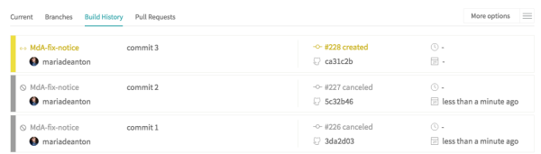

# 自定义构建

> [原文](https://docs.travis-ci.com/user/customizing-the-build)

[TOC]


## 构建配置[#](#travis-ci-build-configuration-and-settings)

​	项目根目录下有一个.travis.yml文件，这是ci配置文件，用作主配置文件。

​	advance:  主配置文件可以import其他共享的配置文件。

## 构建生命周期[#](#build-lifecycle)

​	[构建声明周期](./jobLifecycle.md)

## 仅构建最新提交[#](#building-only-the-latest-commit)

​	如果仅对每个分支上的最新提交进行构建，则可以使用此新功能自动取消队列中尚未运行的较早版本。以进行中的构建不会被取消。

​	自动取消设置位于每个存储库的“设置”选项卡中，您可以分别将其启用：

- 自动取消分支构建-取消分支中排队的构建，并显示在存储库的“构建历史”选项卡中。
- 自动取消拉取请求构建-取消拉取请求的排队构建，并显示在存储库的“拉取请求”选项卡中。

###   自动取消

​		例如，在下面的屏幕截图中，当构建＃226和＃227排队时，我们将提交ca31c2b推送到了分支MdA-fix-notice。启用自动取消功能后，版本＃226和＃227被自动取消：




## 构建指定分支[#](#building-specific-branches)

​	当在有.travis.yml文件的分支下提交时会触发构建

###    包含或移除分支[#](#safelisting-or-blocklisting-branches)

```yml
# blocklist
branches:
  except:
  - legacy
  - experimental

# safelist
branches:
  only:
  - master
  - stable
```

​		需要注意的是，tag构建也被排除在safelist之外。如果都是通过像v1.3.0的格式进行的tag构建，那么可以通过正则表达式来safelist它们，比如：`/^v\d+\.\d+(\.\d+)?(-\S*)?$/`

​		在同时有blocklist和safelist的情况下，safelist优先。默认情况下，gh-pages分支不会被构建，除非你添加到safelist中。

​		构建所有分支：

```yaml
branches:
  only:
  - gh-pages
  - /.*/
```

​		因为历史原因，.travis.yml应该出现在所有被激活构建的分支上。

###	  使用正则表达式[#](#using-regular-expressions)

​		你可以使用正则表达式来safelist 或者 blocklist 分支：

```yaml
branches:
  only:
  - master
  - /^deploy-.*$/
```

​		在最后的/后面指定参数是不支持的，可以通过在行内指定。比如：`/^(?i:deploy)-.*$/`能够匹配`Deploy-2014-06-01`和任何以`deploy-`开头的分支和tag。

##	跳过一次构建[#](#skipping-a-build)

​	如果你处于任何原因不想对某个commit进行构建，你可以通过在commit信息中加上一个命令要求travis ci跳过这次构建。

​	命令应该是下面形式之一：

```yaml
[<KEYWORD> skip]
```

​	或者

```yaml
[skip <KEYWORD>]
```

​	这里`KEYWORD`可以为`ci`, `travis`, `travis ci`, `travis-ci`,`travisci`中的其中一个。比如：

```yaml
[skip travis] Update README
```

​	注意如果有多次commit一起推送，只有在HEAD commit的commit信息中有skip命令才会生效。

##	构建矩阵[#](#build-matrix)

​	对于私有和公共仓库，构建矩阵有着上限200任务（job）的限制。如果你在开源计划内（也就是你的仓库是公开的），那么travis ci将为社区提供免费服务。

###  在矩阵内命名任务（job）[#](#naming-jobs-within-matrices)

​		你可以为矩阵中的指定任务定义name。建议使用唯一的job name，但这个不是强制性的（尽管这个可能在以后改变）。定义在`matrix.include`的job能像如下所示被命名：

```yaml
language: python
jobs:
  include:
  - name: "3.5 Unit Test"
    python: "3.5"
    env: TEST_SUITE=suite_3_5_unit
  - name: "3.5 Integration Tests"
    python: "3.5"
    env: TEST_SUITE=suite_3_5_integration
  - name: "pypy Unit Tests"
    python: "pypy"
    env: TEST_SUITE=suite_pypy_unit
script: ./test.py $TEST_SUITE
```

###	排除任务[#](#excluding-jobs)

​	如果你想排除的任务中有共享相同的matrix参数，你可以仅仅指定它们并且忽略变化的参数。

​	假设你有：

```yaml
language: ruby
rvm:
- 1.9.3
- 2.0.0
- 2.1.0
env:
- DB=mongodb
- DB=redis
- DB=mysql
gemfile:
- Gemfile
- gemfiles/rails4.gemfile
- gemfiles/rails31.gemfile
- gemfiles/rails32.gemfile
```

​	这将导致一个3x3x4的构建矩阵。去排除所有`rvm`值为2.0.0并且`femfile`值为Gemfile的job,可以这样写：

```yaml
jobs:
  exclude:
  - rvm: 2.0.0
    gemfile: Gemfile
```

​	这等价于：

```yaml
jobs:
  exclude:
  - rvm: 2.0.0
    gemfile: Gemfile
    env: DB=mongodb
  - rvm: 2.0.0
    gemfile: Gemfile
    env: DB=redis
  - rvm: 2.0.0
    gemfile: Gemfile
    env: DB=mysql
```

####	排除带有`env`值的任务[#](#excluding-jobs-with-env-value)

​	值必须精确匹配。比如：

```yaml
language: ruby
rvm:
- 1.9.3
- 2.0.0
- 2.1.0
env:
- DB=mongodb SUITE=all
- DB=mongodb SUITE=compact
- DB=redis
- DB=mysql
jobs:
  exclude:
    - rvm: 1.9.3
      env: DB=mongodb
```

​	这定义了一个3x4的矩阵，因为`env`值没有譬如陪到任何一个在矩阵中的job。

​	去排除所有带有`DB=mongodb`设置的Ruby 1.9.3任务，需要这样：

```yaml
language: ruby
rvm:
- 1.9.3
- 2.0.0
- 2.1.0
env:
- DB=mongodb SUITE=all
- DB=mongodb SUITE=compact
- DB=redis
- DB=mysql
jobs:
  exclude:
    - rvm: 1.9.3
      env: DB=mongodb SUITE=all # not 'env: DB=mongodb  SUITE=all' or 'env: SUITE=all DB=mongodb'
    - rvm: 1.9.3
      env: DB=mongodb SUITE=compact # not 'env: SUITE=compact DB=mongodb'
```

###	显式的包含任务[#](#explicitly-including-jobs)

​	可以通过`matrix.include`添加任务到矩阵中。

```yaml
jobs:
  include:
  - rvm: ruby-head
    gemfile: gemfiles/Gemfile.rails-3.2.x
    env: ISOLATED=false
```

​	这添加一个特殊的任务到一个已经填充过的矩阵当中。
​	可以使用这个方法去创建一个只包含指定组合的构建矩阵。在下面创建了一个带有三个任务的矩阵，它们为每个版本的python运行测试套件。

```yaml
language: python
jobs:
  include:
  - python: "2.7"
    env: TEST_SUITE=suite_2_7
  - python: "3.8"
    env: TEST_SUITE=suite_3_8
  - python: "pypy"
    env: TEST_SUITE=suite_pypy
script: ./test.py $TEST_SUITE
```

####	显式包含的任务继承了数组中的第一个值[#](#explicitly-included-jobs-inherit-the-first-value-in-the-array)

​	明确包含的作业将继承定义的扩展键的第一个值。
​	在这个带有3个python任务的构建矩阵中，每个在`matrix.include`中的任务都将`python`设置为`3.8`。你可以显式的为指定任务设置python版本：

```yaml
language: python
python:
  - '3.8'
  - '3.7'
  - '2.7'
jobs:
  include:
    - python: '3.8' # this is not strictly necessary
      env: EXTRA_TESTS=true
    - python: '3.7'
      env: EXTRA_TESTS=true
script: env $EXTRA_TESTS ./test.py $TEST_SUITE
```

###	允许失败的任务[#](#jobs-that-are-allowed-to-fail)

​	你可以在矩阵中定义允许失败的任务。

​	允许失败是那些在你的矩阵中允许构建失败但不会导致整体构建失败的任务。你可以在实验和预备构建中添加这个特性。比如你想测试你还没打算官方支持的运行时版本和配置时。

​	在构建矩阵中定义`allow_failures`：

```yaml
jobs:
  allow_failures:
  - rvm: 1.9.3
```

####	有条件的允许任务失败[#](#conditionally-allowing-jobs-to-fail)

​	`allow_failures`中可以使用`if`关键字包含一个条件。

比如，下面的实例中只允许在`master`分支上使用`rvm: 1.9.3`的任务失败：

```yaml
jobs:
  allow_failures:
  - rvm: 1.9.3
    if: branch = master
```

####	与allow_failures匹配的工作[#](#matching-jobs-with-allow_failures)

​	当根据`allow_failures`d的定义匹配任务时，必须完全满足在`allow_failures`中的条目上指定的所有属性，并且`allow_failures`元素中的所有键必须存在于构建矩阵的顶层（即，不在`matrix.include`中）。

​	`allow_failures`示例：

```yaml
language: ruby

rvm:
- 2.0.0
- 2.1.6

env:
  global:
  - SECRET_VAR1=SECRET1
  jobs:
  - SECRET_VAR2=SECRET2

jobs:
  allow_failures:
    - env: SECRET_VAR1=SECRET1 SECRET_VAR2=SECRET2
```

​	在此，不允许任何任务失败，因为没有作业具有`env`值`SECRET_VAR1 = SECRET1 SECRET_VAR2 = SECRET2`。

```yaml
language: php
php:
- 5.6
- 7.0
jobs:
  include:
  - php: 7.0
    env: KEY=VALUE
  allow_failures:
  - php: 7.0
    env: KEY=VALUE
```

​	没有顶级`env`，将不允许任何作业失败。

#### 	快速结束[#](#fast-finishing)

​	如果允许构建矩阵中的某些任务失败，则在构建完成之前，不会将其标记为已完成。

​	要尽快将构建标记为已完成，请在`.travis.yml`的`matrix`部分中添加`fast_finish：true`，如下所示：

```yacas
jobs:
  fast_finish: true
```
​	现在，在所有必需的作业完成后立即确定构建结果，而其余allow_failures作业将继续运行。

##	安装第二种编程语言[#](#installing-a-second-programming-language)

​	如果需要在当前的构建环境中安装第二种编程语言，则可以在构建的`before_install`阶段进行。

​	例如，您可以使用以下方式在Python构建中安装Ruby的自定义版本：

```yaml
language: python

before_install:
- rvm install 2.1.5
```

​	你还可以像这样在Node.js构建中安装自定义PHP版本：

```yaml
language: node_js

before_install:
- phpenv global 7.0
```

​	也可以使用其他语言安装方法，例如`apt-get`，`pyenv`适用于Python，`nvm`适用于Node.js等。

##	实现复杂的构建步骤[#](#implementing-complex-build-steps)

​	如果你具有很难在`.travis.yml`中进行配置的复杂构建环境，请考虑将这些步骤移至单独的Shell脚本中。该脚本可以作为存储库的一部分，并且可以从`.travis.yml`中轻松调用。
​	有关如何执行此操作的更多信息，请参见[复杂的构建命令](./jobLifecycle.md#complex-build-commands)。

##	我可以使用哪些存储库提供商或版本控制系统？[#

在[travis-ci.com](https://travis-ci.com/)上可以构建和测试在github上托管的开源和私有仓库（私有的需收费）。Travis CI还可以与[Atlassian Bitbucket](https://bitbucket.org/)，[GitLab](https://about.gitlab.com/)和Assembla集成

##	故障排除（troubleshooting）[#](#troubleshooting)

​	[原文](https://docs.travis-ci.com/user/common-build-problems/)